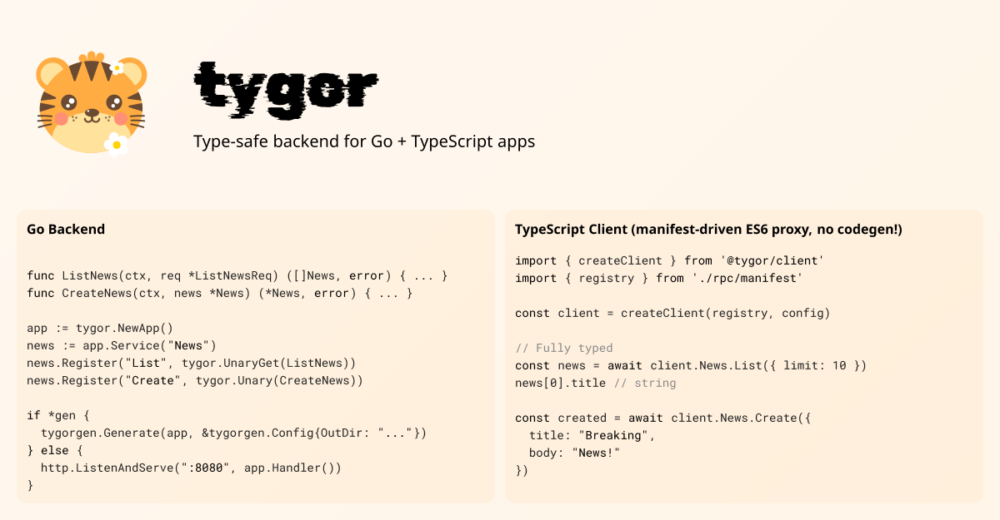

[](https://pkg.go.dev/github.com/broady/tygor) [](https://www.npmjs.com/package/@tygor/client)

# tygor

Type-safe Go backend for web apps.

Write Go functions, call them from TypeScript with full type safety. No IDL required.

## What it looks like

**Write Go types and handlers:**

<!-- [snippet:doc/examples/quickstart:types] -->
```go title="types.go"
type User struct {
	ID    int64  `json:"id"`
	Name  string `json:"name"`
	Email string `json:"email" validate:"required,email"`
}

type GetUserRequest struct {
	ID int64 `json:"id"`
}

type CreateUserRequest struct {
	Name  string `json:"name" validate:"required,min=2"`
	Email string `json:"email" validate:"required,email"`
}

```
<!-- [/snippet:doc/examples/quickstart:types] -->

<!-- [snippet:doc/examples/quickstart:handlers] -->
```go title="main.go"
func GetUser(ctx context.Context, req *GetUserRequest) (*User, error) {
	// ...
}

func CreateUser(ctx context.Context, req *CreateUserRequest) (*User, error) {
	// ...
}

```
<!-- [/snippet:doc/examples/quickstart:handlers] -->

**tygor generates TypeScript types:**

<!-- [snippet:doc/examples/quickstart:generated-types] -->
```typescript title="generated_types.ts"
// Code generated by tygor. DO NOT EDIT.
export interface User {
  id: number;
  name: string;
  email: string;
}
```
<!-- [/snippet:doc/examples/quickstart:generated-types] -->

**Call your API with full type safety:**

<!-- [snippet:doc/examples/quickstart:client-call] -->
```typescript title="client_usage.ts"
const user = await client.Users.Get({ id: "123" });
// user: User (autocomplete works)
```
<!-- [/snippet:doc/examples/quickstart:client-call] -->

## Try it now

Clone the React + Vite example and start building:

```bash
bunx degit broady/tygor/examples/react#v0.8.1 my-app
cd my-app && bun i && bun dev
```

Or with npm: `npx degit broady/tygor/examples/react#v0.8.1 my-app`

Prerequisites: Go 1.21+, Node.js 18+

## Quick Start

If you prefer to start from scratch rather than the example above:

### 1. Create your app with an export function

The CLI finds your app by scanning for any exported function that returns `*tygor.App`:

<!-- [snippet:doc/examples/quickstart:setup-app] -->
```go title="main.go"
func SetupApp() *tygor.App {
	app := tygor.NewApp()

	users := app.Service("Users")
	users.Register("Get", tygor.Query(GetUser))      // GET request
	users.Register("Create", tygor.Exec(CreateUser)) // POST request

	return app
}

```
<!-- [/snippet:doc/examples/quickstart:setup-app] -->

- **Query** handlers serve GET requests (query params in URL)
- **Exec** handlers serve POST requests (JSON body)

<!-- [snippet:doc/examples/quickstart:main] -->
```go title="main.go"
app := SetupApp()
http.ListenAndServe(":8080", app.Handler())
```
<!-- [/snippet:doc/examples/quickstart:main] -->

### 2. Generate TypeScript

```bash
# Generate types and manifest
tygor gen ./src/rpc

# With Zod schemas for client-side validation
tygor gen ./src/rpc --flavor zod
```

This creates:
- `types.ts` - TypeScript interfaces for all your Go types
- `manifest.ts` - Service registry for the client
- `schemas.zod.ts` - Zod schemas (with `--flavor zod`)

### 3. Call from TypeScript

```typescript
import { createClient } from "@tygor/client";
import { registry } from "./rpc/manifest";

const client = createClient(registry, {
  baseUrl: "http://localhost:8080",
});

// Type-safe API calls
const user = await client.Users.Get({ id: 123 });
console.log(user.name); // autocomplete works
```

## Development with Vite

The Vite plugin gives you hot reload, error overlay, and devtools:

```bash
npm install @tygor/vite-plugin
```

```typescript title="vite.config.ts"
import { defineConfig } from "vite";
import { tygor } from "@tygor/vite-plugin";

export default defineConfig({
  plugins: [
    tygor({
      workdir: "../server",  // Path to your Go module
      build: "go build -o ./tmp/server .",
      start: (port) => ({ cmd: `./tmp/server -port=${port}` }),
    }),
  ],
});
```

The plugin automatically:
- Runs `tygor gen` on startup and file changes
- Hot-reloads your Go server with zero downtime
- Shows build errors in-browser
- Provides a devtools sidebar with API info

Your frontend state persists across server reloads. See [@tygor/vite-plugin](./vite-plugin) for full docs.

## Why tygor?

- **No IDL required.** Go structs are your schema. Or use [protobuf](./examples/protobuf) if you prefer schema-first.
- **Standard HTTP/JSON.** Debuggable with curl. Cacheable. Works with your existing infra.
- **Tiny client.** Proxy-based, <3KB. No per-endpoint generated code.
- **Go-native.** Works with `net/http`, your middleware, your patterns.

## Who is this for?

**Use tygor if you:**
- Build fullstack apps with Go backend + TypeScript frontend
- Work in a monorepo (or want types to stay in sync)
- Prefer iterating on code over maintaining schema files
- Would use tRPC if your backend was TypeScript

**Consider alternatives if you:**
- Need multi-language clients → OpenAPI generators
- Need strict public API contracts → Connect/gRPC with protobuf

## Features

### Error Handling

Structured error codes that map to HTTP status:

<!-- snippet-ignore -->
```go
return nil, tygor.NewError(tygor.CodeNotFound, "user not found")
// → HTTP 404, JSON: {"code": "not_found", "message": "user not found"}
```

Validation errors return `CodeInvalidArgument` automatically when `validate` tags fail.

### Validation

Server-side validation with `validator/v10` tags, client-side with generated Zod schemas:

<!-- snippet-ignore -->
```go
type CreateUserRequest struct {
    Name  string `json:"name" validate:"required,min=2"`
    Email string `json:"email" validate:"required,email"`
}
```

See [examples/zod](./examples/zod) for client-side validation with Zod.

### Caching

Cache control for Query (GET) endpoints:

<!-- snippet-ignore -->
```go
users.Register("Get", tygor.Query(GetUser).
    CacheControl(tygor.CacheConfig{MaxAge: 5 * time.Minute, Public: true}))
```

### Interceptors

Cross-cutting concerns at app, service, or handler level:

<!-- snippet-ignore -->
```go
app.WithUnaryInterceptor(loggingInterceptor)
service.WithUnaryInterceptor(authInterceptor)
handler.WithUnaryInterceptor(auditInterceptor)
```

Execution order: app → service → handler → your function.

### Middleware

Standard HTTP middleware:

<!-- snippet-ignore -->
```go
app.WithMiddleware(middleware.CORS(middleware.CORSAllowAll))
```

## CLI Reference

```bash
tygor gen <outdir>           # Generate TypeScript types and manifest
  -p, --package    Package to scan (default: current directory)
  -f, --flavor     Add Zod schemas: zod, zod-mini
  -d, --discovery  Generate discovery.json for runtime introspection
  -c, --check      Check if files are up-to-date (for CI)

tygor check                  # Validate exports without generating

tygor dev                    # Start devtools server (used by Vite plugin)
  --rpc-dir        Directory with discovery.json
  --port           Server port (default: 9000)
```

## Advanced: Programmatic Generation

You can also generate types programmatically, useful for custom build scripts:

<!-- [snippet:doc/examples/quickstart:generation] -->
```go title="main.go"
tygorgen.FromApp(app).ToDir("./client/src/rpc")
```
<!-- [/snippet:doc/examples/quickstart:generation] -->

## Examples

| Example | Description |
|---------|-------------|
| [react](./examples/react) | React + Vite starter with type-safe API calls |
| [zod](./examples/zod) | Client-side validation from Go validate tags |
| [newsserver](./examples/newsserver) | Simple CRUD API to explore the basics |

See [all examples](./examples) including auth, protobuf, and more.

## Status

> [!IMPORTANT]
> tygor is pre-release. The API and protocol may change.
> Pin `@tygor/client` and `github.com/broady/tygor` to the same version.

## License

MIT

Tiger image by Yan Liu, licensed under CC-BY.
