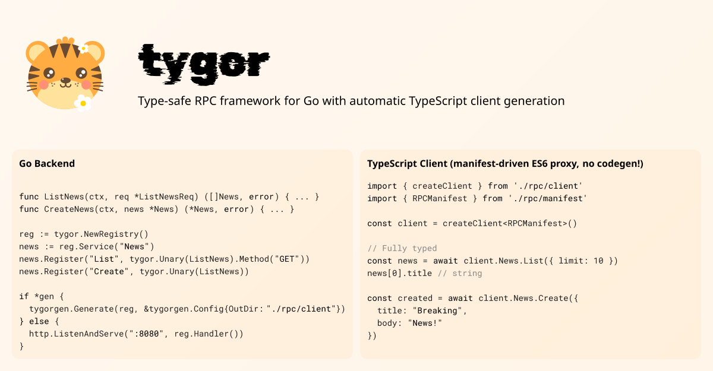

[](https://pkg.go.dev/github.com/broady/tygor)

# tygor

Type-safe RPC framework for Go with automatic TypeScript client generation.

Your Go functions, served over JSON-encoded HTTP, called by a type-only client with a <3 KB bundle impact (no tree-shaking needed!)

> [!IMPORTANT]
> tygor is pre-release and the API and protocol may still change.
> Pin the `@tygor/client` client package and `github.com/broady/tygor` Go module to the same version to avoid any breakage or incompatability.

## Features

- Type-safe handlers using Go generics
- Automatic TypeScript generation from Go types
- Lightweight TypeScript client using proxies for minimal bundle size
- Zero reflection at runtime for handler execution
- Request validation with struct tags
- Flexible error handling with structured error codes
- Middleware and interceptors at global, service, and handler levels
- Built-in support for GET and POST methods with appropriate decoding

## Philosophy

**tygor is for teams building tightly-coupled Go and TypeScript applications.**

If you're building a fullstack application where the Go backend and TypeScript frontend live together, tygor gives you end-to-end type safety without the ceremony of IDLs like protobuf or OpenAPI specs. You write normal Go functions, and tygor generates TypeScript types that match your actual implementation.

### Who is this for?

**Use tygor if you:**
- Build fullstack apps with Go + TypeScript, especially in a monorepo
- Want type safety without learning protobuf/gRPC/OpenAPI
- Value iteration speed and developer ergonomics
- Want to write idiomatic Go handlers and get TypeScript types automatically
- Are okay with incrementally improving types as your domain evolves

**Don't use tygor if you:**
- Need a public API with strict backward compatibility guarantees of a formal IDL (protobuf, Thrift, etc.)
- Require multi-language client support (though OpenAPI generation is planned)

### The tradeoff

tygor isn't trying to be a perfect code generation tool like protobuf. Instead, it's optimized for the common case: a team iterating on a fullstack app where the backend and frontend are tightly coupled anyway. You can always add handwritten TypeScript definitions to improve type safety for your specific domain. This is often nicer than being forced into the constraints of an IDL.

In the future, tygor may generate OpenAPI specs to enable client generation in other languages, giving you the best of both worlds: ergonomic Go + TypeScript for your core app, with optional compatibility for other ecosystems.

If you do need backward compatability guarantees, then you need to treat your Go struct definitions in the same way you would a protobuf. There are no field tags, so renaming a field is a breaking operation! This might be where OpenAI schema generation might help flag any wire-level breaking changes in your API.

## Installation

### Go (server-side)

```bash
go get github.com/broady/tygor
```

### TypeScript/JavaScript (client-side)

```bash
npm install @tygor/client
```

Or with your preferred package manager:
```bash
pnpm add @tygor/client
bun add @tygor/client
yarn add @tygor/client
```

## Quick Start

### 1. Define your types

```go
package api

type News struct {
    ID        int32      `json:"id"`
    Title     string     `json:"title"`
    Body      *string    `json:"body"`
    CreatedAt *time.Time `json:"created_at"`
}

type ListNewsParams struct {
    Limit  *int32 `json:"limit"`
    Offset *int32 `json:"offset"`
}

type CreateNewsParams struct {
    Title string  `json:"title" validate:"required,min=3"`
    Body  *string `json:"body"`
}
```

### 2. Implement handlers

```go
func ListNews(ctx context.Context, req *ListNewsParams) ([]*News, error) {
    // Your implementation
    return news, nil
}

func CreateNews(ctx context.Context, req *CreateNewsParams) (*News, error) {
    // Your implementation
    return &news, nil
}
```

### 3. Register services

```go
reg := tygor.NewRegistry()

news := reg.Service("News")
news.Register("List", tygor.UnaryGet(ListNews))
news.Register("Create", tygor.Unary(CreateNews)) // POST is default

http.ListenAndServe(":8080", reg.Handler())
```

### 4. Generate TypeScript types

```go
if err := tygorgen.Generate(reg, &tygorgen.Config{
    OutDir: "./client/src/rpc",
}); err != nil {
    log.Fatal(err)
}
```

This generates TypeScript types and a manifest describing all available RPC methods.

### 5. Use the TypeScript client

First, install the client runtime:

```bash
npm install @tygor/client
```

The generated client provides a clean, idiomatic API with full type safety:

```typescript
import { createClient } from '@tygor/client';
import { registry } from './rpc/manifest';

const client = createClient(
  registry,
  {
    baseUrl: 'http://localhost:8080',
    headers: () => ({
      'Authorization': 'Bearer my-token'
    })
    // fetch: customFetch  // Optional: for testing or custom environments
  }
);

// Type-safe calls with autocomplete
const news = await client.News.List({ limit: 10, offset: 0 });
// news: News[]

const created = await client.News.Create({
  title: "Breaking News",
  body: "Important update"
});
// created: News

// Errors are properly typed with a hierarchy:
// - TygorError (base class)
//   - RPCError: application errors from the server (has code, message, details)
//   - TransportError: network/proxy errors (has httpStatus, rawBody)
try {
  await client.News.Create({ title: "x" }); // Validation error
} catch (err) {
  if (err instanceof RPCError) {
    console.error(err.code, err.message); // "invalid_argument", "validation failed"
    console.error(err.details);           // Additional error context
  } else if (err instanceof TransportError) {
    console.error("Transport error:", err.httpStatus);
  }
}
// See doc/TYPESCRIPT-CLIENT.md for detailed error handling patterns.
```

The client uses JavaScript Proxies to provide method access without code generation bloat. Your bundle only includes the types and a small runtime, regardless of how many RPC methods you have.

Example `manifest.ts`:

```typescript
export interface RPCManifest {
  "News.List": {
    req: types.ListNewsParams;
    res: types.News[];
  };
  "News.Create": {
    req: types.CreateNewsParams;
    res: types.News;
  };
}

const metadata = {
  "News.List": { method: "GET", path: "/News/List" },
  "News.Create": { method: "POST", path: "/News/Create" },
} as const;

export const registry: ServiceRegistry<RPCManifest> = {
  manifest: {} as RPCManifest,
  metadata,
};
```

## Request Handling

### GET Requests

For GET requests, parameters are decoded from query strings:

```go
type ListParams struct {
    Limit  *int32 `json:"limit"`
    Offset *int32 `json:"offset"`
}

tygor.UnaryGet(List)
```

Query: `/News/List?limit=10&offset=20`

### POST Requests

For POST requests (the default), the body is decoded as JSON:

```go
type CreateParams struct {
    Title string `json:"title" validate:"required"`
}

tygor.Unary(Create) // POST is default
```

## Error Handling

Use structured error codes for consistent error responses:

```go
func CreateNews(ctx context.Context, req *CreateNewsParams) (*News, error) {
    if req.Title == "invalid" {
        return nil, tygor.NewError(tygor.CodeInvalidArgument, "invalid title")
    }
    return &news, nil
}
```

Available error codes:
- `CodeOK` (200)
- `CodeInvalidArgument` (400)
- `CodeUnauthenticated` (401)
- `CodePermissionDenied` (403)
- `CodeNotFound` (404)
- `CodeAlreadyExists` (409)
- `CodeResourceExhausted` (429)
- `CodeInternal` (500)
- `CodeUnavailable` (503)

### Custom Error Transformers

Map application errors to RPC errors:

```go
reg := tygor.NewRegistry().
    WithErrorTransformer(func(err error) *tygor.Error {
        if errors.Is(err, sql.ErrNoRows) {
            return tygor.NewError(tygor.CodeNotFound, "not found")
        }
        return nil
    })
```

### Masking Internal Errors

Prevent sensitive error details from leaking in production:

```go
reg := tygor.NewRegistry().WithMaskInternalErrors()
```

## Interceptors

Interceptors provide cross-cutting concerns at different levels.

### Global Interceptors

Applied to all handlers:

```go
reg := tygor.NewRegistry().
    WithInterceptor(middleware.LoggingInterceptor(logger))
```

### Service Interceptors

Applied to all handlers in a service:

```go
news := reg.Service("News").
    WithInterceptor(authInterceptor)
```

### Handler Interceptors

Applied to specific handlers:

```go
news.Register("Create",
    tygor.Unary(CreateNews).
        WithUnaryInterceptor(func(ctx *tygor.Context, req any, handler tygor.HandlerFunc) (any, error) {
            // Custom logic - access ctx.Service(), ctx.Method(), ctx.HTTPRequest(), etc.
            return handler(ctx, req)
        }))
```

## Middleware

HTTP middleware wraps the entire registry:

```go
reg := tygor.NewRegistry().
    WithMiddleware(middleware.CORS(middleware.DefaultCORSConfig()))

http.ListenAndServe(":8080", reg.Handler())
```

## Validation

### POST Requests

POST request bodies are validated using struct tags via the `validator/v10` package:

```go
type CreateParams struct {
    Title string `json:"title" validate:"required,min=3,max=100"`
    Email string `json:"email" validate:"required,email"`
}
```

### GET Requests

GET request query parameters are decoded using `gorilla/schema` and then validated with `validator/v10`:

```go
type ListParams struct {
    Limit  int    `schema:"limit" validate:"min=0,max=100"`
    Offset int    `schema:"offset" validate:"min=0"`
    Status string `schema:"status" validate:"omitempty,oneof=draft published"`
}
```

Query: `/News/List?limit=10&offset=0&status=published`

**Note:** `gorilla/schema` uses case-insensitive matching for query parameter names. Without a `schema` tag, the field name is used (e.g., field `Limit` matches query param `limit`, `Limit`, or `LIMIT`). For clarity, always use explicit `schema` tags.

## Caching

Set cache headers on GET handlers using `CacheControl`:

```go
news.Register("List",
    tygor.UnaryGet(ListNews).
        CacheControl(tygor.CacheConfig{
            MaxAge: 5 * time.Minute,
            Public: true,
        }))
```

Common patterns:

```go
// Browser-only caching (private)
CacheControl(tygor.CacheConfig{MaxAge: 5 * time.Minute})

// CDN + browser caching (public)
CacheControl(tygor.CacheConfig{MaxAge: 5 * time.Minute, Public: true})

// Stale-while-revalidate for smooth updates
CacheControl(tygor.CacheConfig{
    MaxAge:               1 * time.Minute,
    StaleWhileRevalidate: 5 * time.Minute,
    Public:               true,
})
```

## Context Access

Access RPC metadata and HTTP primitives via `tygor.FromContext`:

```go
func Handler(ctx context.Context, req *Request) (*Response, error) {
    tc, ok := tygor.FromContext(ctx)
    if ok {
        // Get service and method name
        service, method := tc.Service(), tc.Method()

        // Access HTTP request headers
        token := tc.HTTPRequest().Header.Get("Authorization")

        // Set custom response headers
        tc.HTTPWriter().Header().Set("X-Custom", "value")
    }

    return &Response{}, nil
}
```

In interceptors, you receive `*tygor.Context` directly:

```go
func loggingInterceptor(ctx *tygor.Context, req any, handler tygor.HandlerFunc) (any, error) {
    log.Printf("calling %s.%s", ctx.Service(), ctx.Method())
    return handler(ctx, req)
}
```

## Type Mappings

Customize TypeScript type generation for third-party types:

```go
tygorgen.Generate(reg, &tygorgen.Config{
    OutDir: "./client/src/rpc",
    TypeMappings: map[string]string{
        "github.com/jackc/pgtype.Timestamptz": "string | null",
        "github.com/jackc/pgtype.UUID":        "string",
    },
})
```

## License

MIT

Tiger image by Yan Liu, licensed under CC-BY (with a few modifications).
