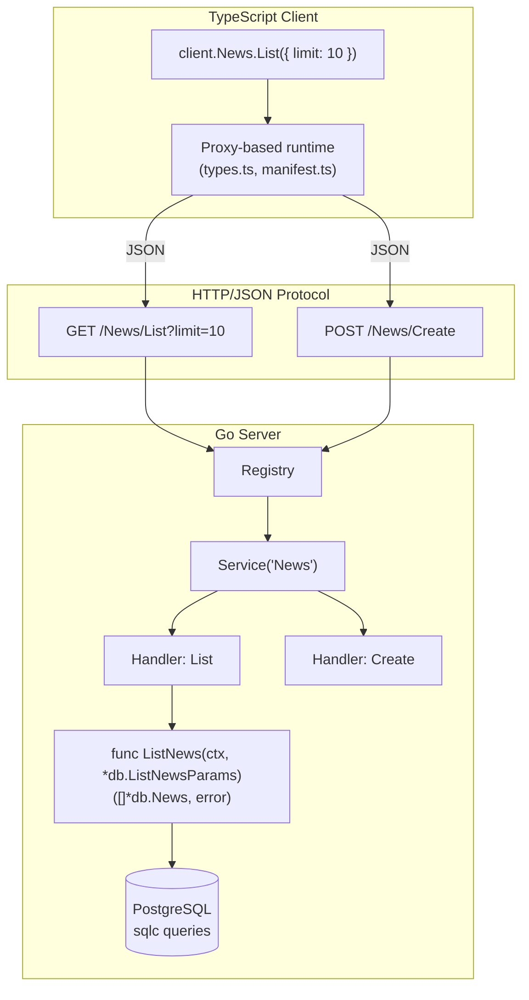

# Tygor Specification

Type-safe RPC framework for Go servers and TypeScript clients. Go structs are the single source of truth; TypeScript types are generated automatically. Designed for integration with `sqlc`-generated database types.

## Architecture



## Documentation Structure

| Document | Purpose | Audience |
|----------|---------|----------|
| [PROTOCOL.md](./doc/PROTOCOL.md) | Language-agnostic wire protocol (HTTP paths, serialization, error codes) | Implementors in other languages, interop |
| [GO-IMPLEMENTATION.md](./doc/GO-IMPLEMENTATION.md) | Go server API (handlers, registry, interceptors, codegen) | Go backend developers |
| [TYPESCRIPT-CLIENT.md](./doc/TYPESCRIPT-CLIENT.md) | TypeScript client implementation (proxy pattern, manifest format) | Frontend developers, client implementors |

## Core Design

**Handler signature:**
```go
func(ctx context.Context, req Req) (Res, error)
```

**Registration:**
```go
reg := tygor.NewRegistry()
news := reg.Service("News")
news.Register("List", tygor.NewHandler(ListNews).Method("GET"))
```

**Client usage:**
```typescript
const news = await client.News.List({ limit: 10 });
```

**Type flow:**
```
SQL query definition
  ↓ sqlc generate
Go struct (ListNewsParams, News)
  ↓ Use as RPC request/response types
Go handler registration
  ↓ tygorgen.Generate(reg, config)
TypeScript types (types.ts, manifest.ts)
  ↓ Consumed by proxy-based client
Type-safe RPC calls
```

## Protocol Summary

**URL structure:** `/{Service}/{Method}`

**HTTP methods:**
- `GET`: Read operations. Parameters in query string (arrays: `?ids=1&ids=2`)
- `POST`: Mutations. Parameters in JSON body

**Error envelope:**
```json
{
  "code": "invalid_argument",
  "message": "human-readable error",
  "details": { "field": "name", "constraint": "required" }
}
```

**Standard error codes:** `invalid_argument` (400), `unauthenticated` (401), `permission_denied` (403), `not_found` (404), `conflict` (409), `internal` (500), `unavailable` (503). See [PROTOCOL.md](./doc/PROTOCOL.md) for complete list.

## Implementation Details

### Go Server

**Handler construction (fluent API):**
```go
h := tygor.NewHandler(ListNews).
    Method("GET").
    Cache(5 * time.Minute).
    WithInterceptor(authInterceptor)
```

**Sealed interface pattern:** `RPCMethod` interface uses internal package types to prevent external implementation. Only `NewHandler` can produce valid handlers.

**Error transformation:**
```go
reg := tygor.NewRegistry().WithErrorTransformer(func(err error) *tygor.Error {
    if errors.Is(err, sql.ErrNoRows) {
        return tygor.NotFound("resource not found")
    }
    return tygor.DefaultErrorTransformer(err)
})
```

**Interceptor chain:** Global → Service → Handler. Signature:
```go
type UnaryInterceptor func(ctx context.Context, req any, info *RPCInfo, handler HandlerFunc) (any, error)
```

**Context API:**
- `RequestFromContext(ctx)`: Access `*http.Request`
- `MethodFromContext(ctx)`: Get service/method names
- `SetHeader(ctx, key, val)`: Set response headers

**Code generation:**
```go
tygorgen.Generate(reg, &tygorgen.Config{
    OutDir: "./client/src/rpc",
    TypeMappings: map[string]string{
        "time.Time": "string",
        "uuid.UUID": "string",
    },
    OptionalType: "undefined", // Go pointers → T | undefined
    EnumStyle: "union",        // type Status = "draft" | "published"
})
```

### TypeScript Client

**Generated files:**
- `types.ts`: TypeScript interfaces for all request/response types
- `manifest.ts`: `RPCManifest` interface + `registry` constant with metadata

**Proxy implementation:** Double proxy (service → method) resolves calls dynamically. No generated method code.

**Client configuration:**
```typescript
const client = createClient({
  baseURL: 'https://api.example.com',
  headers: { 'Authorization': `Bearer ${token}` },
  fetch: customFetch,  // For Node.js, testing, middleware
  onError: (error) => { /* handle RPC errors */ }
});
```

**Error handling:**
```typescript
try {
  await client.News.Create(params);
} catch (error) {
  if (error instanceof RPCError) {
    console.log(error.code, error.message, error.details);
  }
}
```

## Design Rationale

**Why Go generics instead of codegen?**
Type safety without build steps. Handler functions are type-checked at compile time. Generic `NewHandler` captures types without reflection overhead.

**Why sealed `RPCMethod` interface?**
Prevents users from implementing the interface incorrectly. Only library-constructed handlers are valid. Enforces handler construction through `NewHandler`.

**Why separate GET/POST?**
RESTful conventions. GET requests are cacheable, appear in logs/browser history without sensitive data. POST for mutations matches HTTP semantics.

**Why proxy-based client instead of generated methods?**
Zero boilerplate. Adding a new RPC requires no client changes—just regenerate types. Manifest provides type safety, proxy provides implementation.

**Why `sqlc` integration?**
Database schema is often the true source of truth. `sqlc` generates Go structs from SQL; these become RPC types directly. Eliminates duplicate type definitions.

**Why custom error codes instead of HTTP-only?**
HTTP status codes are too coarse. `invalid_argument` vs `permission_denied` vs `not_found` all return different status codes but need application-level distinction. `details` field provides structured context.

**Why interceptors over middleware?**
Interceptors have access to typed request/response (as `any`) and can be scoped (global/service/handler). Standard HTTP middleware only sees bytes.

## Comparison to Alternatives

| | Tygor | gRPC | tRPC | Connect |
|-|-------|------|------|---------|
| Schema | Go structs | .proto | TS types | .proto |
| Protocol | HTTP/JSON | HTTP/2+Protobuf | HTTP/JSON | HTTP/2+Protobuf+JSON |
| Type safety | Go→TS codegen | Multi-lang codegen | TS→TS inference | Multi-lang codegen |
| Browser support | Native | Requires proxy | Native | Native |
| HTTP caching | Standard | Custom | Standard | Custom |
| DB integration | sqlc structs → RPC types | Manual mapping | Manual mapping | Manual mapping |
| Client complexity | Proxy pattern | Generated stubs | Imported procedures | Generated stubs |

**Tygor trade-offs:**
- (+) Simple HTTP/JSON tooling, debugging, caching
- (+) Direct `sqlc` integration eliminates type duplication
- (+) No server-side codegen (pure Go generics)
- (−) Go/TS only (not multi-language like gRPC/Connect)
- (−) JSON serialization overhead vs Protobuf
- (−) No streaming (HTTP/1.1 request/response only)

## Quick Reference

**Minimal server:**
```go
func ListNews(ctx context.Context, req *db.ListNewsParams) ([]*db.News, error) {
    return db.New(pool).ListNews(ctx, req)
}

func main() {
    reg := tygor.NewRegistry()
    news := reg.Service("News")
    news.Register("List", tygor.NewHandler(ListNews).Method("GET"))
    tygorgen.Generate(reg, &tygorgen.Config{OutDir: "./client/src/rpc"})
    http.ListenAndServe(":8080", reg)
}
```

**Minimal client:**
```typescript
import { createClient } from './rpc-client';

const client = createClient({ baseURL: 'http://localhost:8080' });
const news = await client.News.List({ limit: 10 });
```

## See Also

- [PROTOCOL.md](./doc/PROTOCOL.md) — Complete wire protocol specification
- [GO-IMPLEMENTATION.md](./doc/GO-IMPLEMENTATION.md) — Go API reference and implementation requirements
- [TYPESCRIPT-CLIENT.md](./doc/TYPESCRIPT-CLIENT.md) — Client implementation guide
